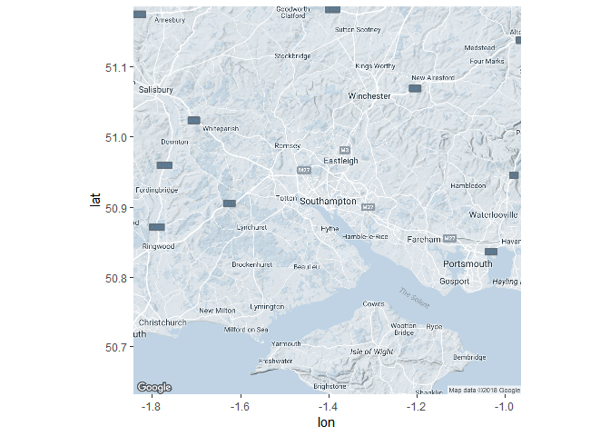
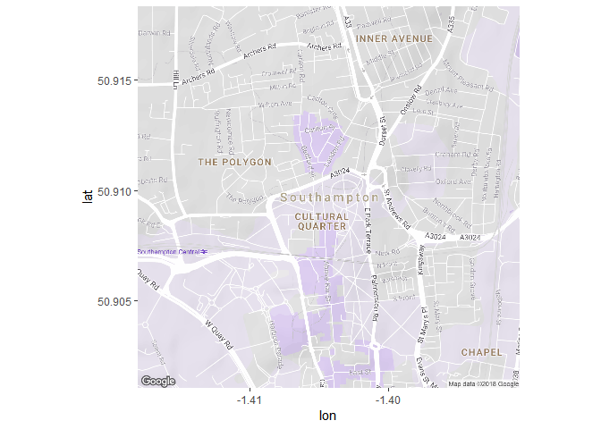

<!-- README.md is generated from README.Rmd. Please edit that file -->
ggmapstyles 
==================================================================================

[](https://travis-ci.org/mikey-harper/ggmapstyles) [](https://ci.appveyor.com/project/mikey-harper/ggmapstyles) [](http://www.repostatus.org/#active)

------------------------------------------------------------------------

Overview
--------

**ggmapstyles** is an R package which extends the [ggmap](https://github.com/dkahle/ggmap) package. This package simplifes the process of creating custom designs for Google Maps, and provides a range of tools for quickly loading themes from [Snazzy Maps](https://snazzymaps.com/) by simply copying a website URL.

Say goodbye to the standard Google Maps background, and easily choose from one of over 16000 custom themes! If you cannot find a style you like, it is easy to sign up and create your own customised layers.



Installation
------------

You can install the development version of the package through Github. It is also recommended that you install the development version of ggmap, as this has increased the size of the maximum URL allowed and allows for more complex styles to be created.

    devtools::install_github("mikey-harper/ggmapstyles")
    devtools::install_github("dkahle/ggmap")

Usage
-----

You can browse [Snazzy Maps](https://snazzymaps.com/) to find a style you like. A number of functions have been developed to simplify the usage of Snazzymaps within existing workflows.

The main function to use within the package is `get_snazzymap`. This is a wrapper of the `get_googlemap` function, with the style of the map being set by `mapRef`:

``` r
library(ggmapstyles)
basemap <- get_snazzymap("Southampton, UK", mapRef = "https://snazzymaps.com/style/83/muted-blue")
ggmap(basemap)
```


The `mapRef` parameter can accept the Snazzy Map reference in a number of different ways:

-   Full URL: `mapRef = "https://snazzymaps.com/style/83/muted-blue"`
-   ID & Name: `mapRef = "83/muted-blue"`
-   ID: `mapRef = 83`

You can also supply additional arguments to the `get_snazzymap` function which are provided to `get_googlemap`. For example, the zoom can be changed as follows:

``` r
basemap <- get_snazzymap("Southampton, UK", mapRef = "98/purple-rain", zoom = 15)
ggmap(basemap)
```



If you would rather use the `style` argument within the `get_googlemap`, you can create a formatted string using the `ggmap_style_sm` function:

``` r
style_string <- ggmap_style_sm("84/pastel-tones")
style_string
#> [1] "feature:landscape%7Csaturation:-100%7Clightness:60&style=feature:road.local%7Csaturation:-100%7Clightness:40%7Cvisibility:on&style=feature:transit%7Csaturation:-100%7Cvisibility:simplified&style=feature:administrative.province%7Cvisibility:off&style=feature:water%7Cvisibility:on%7Clightness:30&style=feature:road.highway%7Celement:geometry.fill%7Ccolor:0xef8c25%7Clightness:40&style=feature:road.highway%7Celement:geometry.stroke%7Cvisibility:off&style=feature:poi.park%7Celement:geometry.fill%7Ccolor:0xb6c54c%7Clightness:40%7Csaturation:-40&style="
```

This string can then easily be reused within any other ggmap function which takes a style argument. This approach is recommended if you want to plot multiple maps with the same basemap:

``` r
plot1 <- ggmap(get_googlemap("Southampton, UK", style = style_string)) + labs(title = "Southampton")
plot2 <- ggmap(get_googlemap("London, UK", style = style_string)) + labs(title = "London")
plot3 <- ggmap(get_googlemap("Bristol, UK", style = style_string)) + labs(title = "Bristol")

gridExtra::grid.arrange(plot1, plot2, plot3, ncol = 3)
```


Additional Reading
------------------

[This cheatsheet](https://www.nceas.ucsb.edu/~frazier/RSpatialGuides/ggmap/ggmapCheatsheet.pdf) into ggmap is useful for picking up some of the basics of ggmap.
